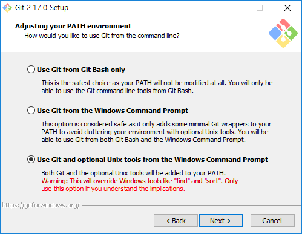

# 오픈소스 프로젝트 활용하기

## Git 설치하기

Git이란 버전 관리 시스템 \(VCS - Version Control System\)으로 파일 변화를 시간에 따라 기록했다가 나중에 특정 시점의 버전을 다시 꺼내올 수 있는 시스템입니다.

Git repository\(저장소\)에 있는 프로젝트의 소스코드를 사용하고 본인의 프로젝트를 관리하기 위해서 Git을 먼저 설치합시다.



콘솔에서 다음 명령어를 실행하세요.

```text
$ sudo apt-get install git
```



윈도우용 Git은 [https://git-scm.com/download/win](https://git-scm.com/download/win) 웹사이트에서 자동으로 다운로드 받을 수 있습니다.

모두 기본 설정을 유지하며 다음으로 넘어가되, 다음 화면에서 "Use Git and optional Unix tools from the Windows command Prompt" 옵션 선택하세요.





## Git 로컬 저장소 만들기


## FreeRun 프로젝트 가져오기

{% embed data="{\"url\":\"https://gitlab.com/minh364/FreeRun\",\"type\":\"link\",\"title\":\"minh364 / FreeRun\",\"description\":\"GitLab.com\",\"icon\":{\"type\":\"icon\",\"url\":\"https://assets.gitlab-static.net/assets/touch-icon-ipad-retina-8ebe416f5313483d9c1bc772b5bbe03ecad52a54eba443e5215a22caed2a16a2.png\",\"width\":152,\"height\":152,\"aspectRatio\":1},\"thumbnail\":{\"type\":\"thumbnail\",\"url\":\"https://assets.gitlab-static.net/assets/gitlab\_logo-7ae504fe4f68fdebb3c2034e36621930cd36ea87924c11ff65dbcb8ed50dca58.png\",\"width\":128,\"height\":128,\"aspectRatio\":1}}" %}

## 나만의 프로젝트 배포하기


