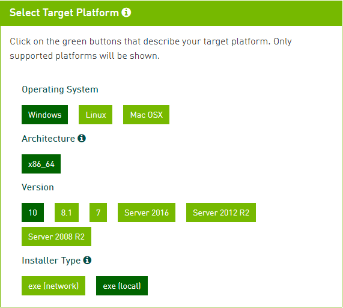
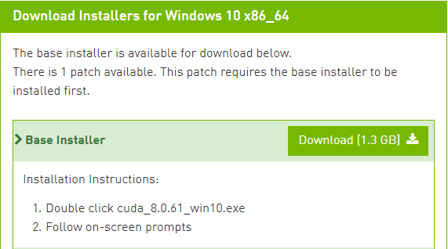
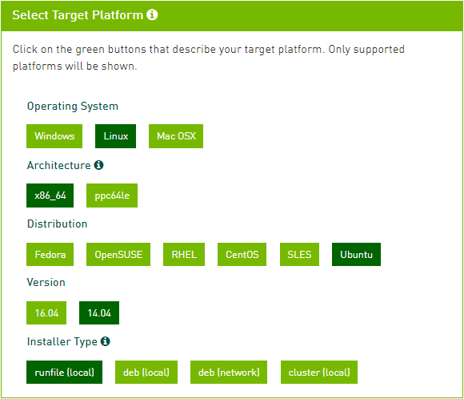
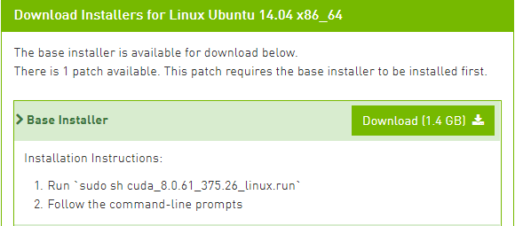

# Tensorflow\(GPU\) 설치하기

## Tensorflow\(GPU\) 설치하기

### Anaconda 가상환경 설정

앞서 개발 환경 관리를 위해 설치했던 아나콘다를 이용하여 가상 환경을 만들어 봅시다. 콘솔 창에서 다음 명령어를 입력하세요. py27은 생성하고자 하는 가상환경의 이름입니다.

```text
$ conda create -n py27
```

가상 환경 생성이 완료되면 다음 명령어를 입력하여 가상환경을 활성화할 수 있습니다.

```text
$ source activate py27
```

> **Note** 가상 환경을 종료하고 싶다면 다음 명령어를 입력하세요.

```text
$ source deactivate
```

> **Note** 가상 환경에 설치된 패키지 리스트를 확인하고 싶다면 다음 명령어를 입력하세요.

```text
$ conda list # 가상 환경 활성화 시
$ conda list -n py27 # 가상 환경 비활성화 시
```


### CUDA Toolkit 설치

텐서플로우 GPU 버전을 사용하기 위해서는 CUDA를 설치해야 합니다. [https://developer.nvidia.com/cuda-80-ga2-download-archive](https://developer.nvidia.com/cuda-80-ga2-download-archive) 웹 사이트에서 CUDA Toolkit 8.0 버전을 다운로드하세요.



> **Note** 자신의 환경에 맞는 옵션을 선택합니다.



> **Note** 모든 옵션을 선택하면 아래와 같은 창을 볼 수 있습니다. Base Installer를 다운로드 하세요.





> **Note** 자신의 환경에 맞는 옵션을 선택합니다.



> **Note** 모든 옵션을 선택하면 아래와 같은 창을 볼 수 있습니다. Base Installer를 다운로드 하세요.



CUDA Toolkit을를 다운 받은 위치에서 다음 명령을 입력하세요. \(다운 받은 버전에 따라 파일명이 다를 수 있습니다.\)

```text
$ sudo sh cuda_8.0.61_375.26_linux.run
```

> **Note** 명령어 입력 후, 라이선스 문구를 건너 뛰려면 `ctrl + c`를 입력하세요. 이후 메시지에 대해서는 다음 지시사항에 따르세요.

```text
# accept 입력
Do you accept the previously read EULA?
accpt/decline/quit: accept

# n 입력
Install NVIDIA Accelerated Graphics Driver for Linux-x86_64 375.26?
(y)es/(n)o/(q)uit: n

# y 입력
Install the CUDA 8.0 Toolkit?
(y)es/(n)o/(q)uit: y

# Enter
Enter Toolkit Location
 [ default is /usr/local/cuda-8.0 ]:

# y 입력
Do you want to install a symbolic link at /usr/local/cuda?
(y)es/(n)o/(q)uit: y

# n 입력
Install the CUDA 8.0 Samples?
(y)es/(n)o/(q)uit: n

# Enter
Enter CUDA Samples Location
 [ default is /home/your_id ]:
```




### CuDNN 설치


### Tensorflow-GPU 설치


## 

