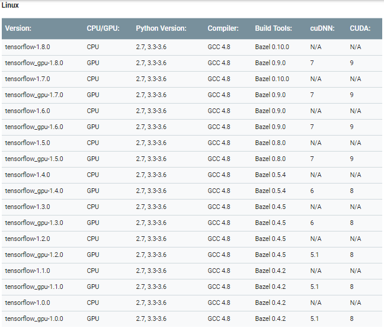

# TensorFlow\(GPU\) 설치


본 프로젝트에서는 tensorflow-gpu-1.4.0 버전을 사용합니다.


설치할 텐서플로우의 버전과 호환되는 CUDA, cuDNN을 설치해야 합니다. 따라서 CUDA 8.0과 cuDNN v6.0을 설치할 것입니다. 다음 표를 참고하세요.



## CUDA Toolkit 설치

[https://developer.nvidia.com/cuda-80-ga2-download-archive](https://developer.nvidia.com/cuda-80-ga2-download-archive) 웹 사이트에서 CUDA Toolkit 8.0 버전을 다운로드하세요.



자신의 환경에 맞는 옵션을 선택합니다.


모든 옵션을 선택하면 아래와 같은 창을 볼 수 있습니다. Base Installer를 다운로드 하세요.


CUDA Toolkit을 다운 받은 위치에서 다음 명령을 입력하세요. \(다운 받은 버전에 따라 파일명이 다를 수 있습니다.\)

```text
$ sudo sh cuda_8.0.61_375.26_linux.run
```



명령어 입력 후, 라이선스 문구를 건너 뛰려면 ctrl + c를 입력하세요. 이후 메시지에 대해서는 다음 지시사항에 따르세요.


```text
# accept 입력
Do you accept the previously read EULA?
accpt/decline/quit: accept

# n 입력
Install NVIDIA Accelerated Graphics Driver for Linux-x86_64 375.26?
(y)es/(n)o/(q)uit: n

# y 입력
Install the CUDA 8.0 Toolkit?
(y)es/(n)o/(q)uit: y

# Enter
Enter Toolkit Location
 [ default is /usr/local/cuda-8.0 ]:

# y 입력
Do you want to install a symbolic link at /usr/local/cuda?
(y)es/(n)o/(q)uit: y

# n 입력
Install the CUDA 8.0 Samples?
(y)es/(n)o/(q)uit: n

# Enter
Enter CUDA Samples Location
 [ default is /home/your_id ]:
```



설치를 마치면 반드시 환경변수를 설정하세요.


콘솔에서 다음 명령을 입력하여 경로를 설정합니다.

```text
$ echo -e "\n## CUDA and cuDNN paths" >> ~/.bashrc
$ echo "export PATH=/usr/local/cuda-8.0/bin${PATH:+:${PATH}}" >> ~/.bashrc
$ echo "export LD_LIBRARY_PATH=/usr/local/cuda-8.0/lib64${LD_LIBRARY_PATH:+:${LD_LIBRARY_PATH}}" >> ~/.bashrc
```



변경된 환경변수를 적용하는 것도 잊지마세요!


```text
$ source ~/.bashrc
```


마지막으로 CUDA가 설치되었는지 확인합니다.

```text
$ nvcc --version
nvcc: NVIDIA (R) Cuda compiler driver
Copyright (c) 2005-2016 NVIDIA Corporation
Built on Tue_Jan_10_13:22:03_CST_2017
Cuda compilation tools, release 8.0, V8.0.61
```



자신의 환경에 맞는 옵션을 선택합니다.


모든 옵션을 선택하면 아래와 같은 창을 볼 수 있습니다. Base Installer를 다운로드 하세요.


\(작성 중\)



## cuDNN 설치

cuDNN은 [https://developer.nvidia.com/rdp/cudnn-archive](https://developer.nvidia.com/rdp/cudnn-archive) 웹사이트에서 회원 가입 후 다운로드할 수 있습니다.

Download cuDNN v6.0 \(April 27, 2017\), for CUDA 8.0을 누르면 아래 사진과 같은 화면을 볼 수 있습니다.




리눅스용 cuDNN v6.0 Runtime Library for Ubuntu 14.04 \(Deb\)를 다운로드 하세요.


파일을 다운 받은 위치에서 다음 명령을 실행합니다.

```text
$ sudo dpkg -i libcudnn6_6.0.21-1+cuda8.0_amd64.deb
```



윈도우용 cuDNN v6.0 Library for Windows 7 또는 Windows 10을 다운로드 하세요.

\(작성중\)



## Anaconda 가상환경 설정

앞서 개발 환경 관리를 위해 설치했던 아나콘다를 이용하여 가상 환경을 만들어 봅시다. 콘솔 창에서 다음 명령어를 입력하세요. 

```text
$ conda create -n tensorflow python=2.7
```

파이썬 2.7 버전의 tensorflow라는 이름의 가상환경이 만들어집니다.


가상 환경 생성이 완료되면 다음 명령어를 입력하여 가상환경을 활성화할 수 있습니다. 프롬프트\($\) 앞에 가상환경 이름이 보이는 것을 확인할 수 있습니다.

```text
$ source activate tensorflow
(tensorflow)$
```

이후 TensorFlow 설치를 위해 가상환경을 활성화한 상태에서 남은 과정을 진행하세요.


> **Note** 가상 환경을 종료하고 싶다면 다음 명령어를 입력하세요.

```text
$ source deactivate
```


> **Note** 가상 환경에 설치된 패키지 리스트를 확인하고 싶다면 다음 명령어를 입력하세요.

```text
$ conda list # 가상 환경 활성화 시
$ conda list -n tensorflow # 가상 환경 비활성화 시
```

## TensorFlow\(GPU\) 설치

지금까지 설치과정을 잘 따라 오셨습니다. 드디어 텐서플로우를 설치할 차례입니다!


가상환경이 활성화된 상태인지 확인하세요.




가상환경이 활성화된 상태인지 확인하고 다음 명령어를 입력하세요.

```text
(tensorflow)$ pip install --ignore-installed --upgrade https://storage.googleapis.com/tensorflow/linux/gpu/tensorflow_gpu-1.4.0rc1-cp27-none-linux_x86_64.whl
```


설치가 완료되었는지 확인하려면 다음 명령어를 입력하세요.

```text
(tensorflow) $ python
>>> import tensorflow as tf
>>> tf.__version__
'1.4.0-rc1'
```



\(작성 중\)



