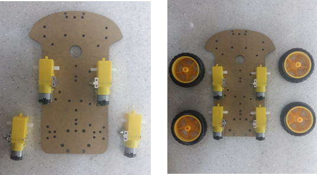

# 무선조종자동차 조립하기

## 무선조종자동차 구성품목 \(준비물\)

#### Arduino 스마트 자동차 4WD kit ver.2 


본 프로젝트에서는 아두이노는 사용하지 않으니, 아래의 부품이 포함된 다른 키트를 구매하거나 개별 구매하여도 좋습니다.


* 자동차 상/하판
* 자동차 바퀴  4개
* L298N 모터 드라이버 보드
* DC Motor x 4
* Mini bread board
* 1.5v 배터리 케이스 \(1.5v x 6\)
* 9v 배터리 케이스

#### Raspberry PI kit

* Raspberry PI 3
* MicroSD 32G
* 2.5A 어댑터
*  MicroSD 카드 리더기
* 방열판
* HDMI 케이블
* Pi Camera Module V2

#### 별도 구매

* ipTIME N100mini-AP dongle

## 무선조종자동차 조립하기

1. DC모터를 조립합니다. 그리고 알루미늄 고정 틀, 긴 나사, 너트를 이용해 DC모터를 차체 하판에 고정시킵니다.

모터에 고정한 알루미늄 고정 틀의 아랫부분 나사 홀과 하단 홀을 일치시켜 볼트로 고정시킵니다. DC 모터에 선이 없는 경우에는 납땜하여 고정시켜야 합니다.  

볼트로 조여주며 DC모터 축 방향이 일직선이 되도록 잘 조절 해 주었다면, 이제 타이어를 끼워줍니다.

